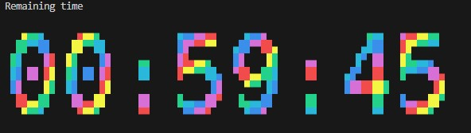
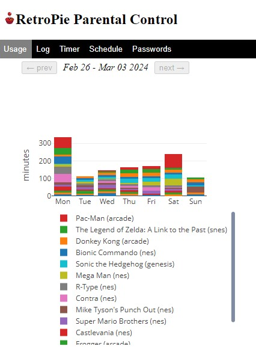

# Parental Control for RetroPie
Adds parental control features to [RetroPie - retro gaming machine](https://retropie.org.uk/) 

**RetroPie-Parental** is a add-on for RetroPie that can added or removed easily using a setup script.  The add-on is intended for RetroPie installations created from images for the raspberry pi.  But it may also work for any custom version of RetroPie.

These Parental Controls were intended for the scenario of having a RetroPie available in a home setting with kids who need a little support with their self control.  It allows a parent to set a schedule of how much time games can be played for each day of the week.  But it also includes a website to make on-the-fly adjustment to the schedule, monitor what is going on, and get reports on past gaming history.


## Quick-install script
```
curl https://raw.githubusercontent.com/zaront/RetroPie-Parental/main/setup.sh | bash
```


## Features
  * Set a daily time limit for each day of the week
  * Monitor what game is being played and for how long
  * View how many minutes are left and change them on-the-fly
  * View reports on gaming activity
  * enter a secret Konami-style code at the console to enable one-time unlimited play
  * gives a 1 minute and a 10 second warning before time expires
  * Easy administration over a locally hosted, mobile friendly website
  * Easily install, update, and uninstall over existing RetroPie


## Screenshots

When a game is started it will show the player how much time they have left.  
Here is what that looks like



Here is an image of the administration website




## Installation
The easiest way to install is by running the [Quick-install script](#quick-install-script) (shown above)

Alternatively, you can install manually.  To do so first clone or download the repository into the home directory of your RetroPie.
```
cd ~
git clone https://github.com/zaront/RetroPie-Parental.git
```
*Note: if you choose to download instead of clone, you will not be able to use the auto-update feature of the `setup.sh update` script as it relies on pulling updates from the git repository.*

At this point you may run `setup.sh install` from the downloaded repository to complete the setup, or you can continue to integrate everything manually as follows.

Install the required packages
```
sudo apt update
sudo apt install git toilet sox python3 python3-pip
```

Install python packages
```
pip3 install -r ~/RetroPie-Parental/requirements.txt
```

Add a hard link of the `runcommand-onend.sh` script to RetroPie
```
ln ~/RetroPie-Parental/runcommand-onend.sh /opt/retropie/configs/all/runcommand-onend.sh
```

Edit `/opt/retropie/configs/all/autostart.sh` and add the following command to the first line.  
This will allow the website to start in the background when RetroPie starts
```
/home/pi/RetroPie-Parental/web.py prod &
```

Sudo edit `/opt/retropie/supplementary/runcommand/runcommand.sh` and add the following commands:

First add the following after `source "$ROOTDIR/lib/inifuncs.sh"` which should be around line #96
```
source "/home/pi/RetroPie-Parental/runcommand-parental.sh"
```
Seconds add the following before `rm -f "$LOG"` within the `runcommand()` function, which should be around line #1328
```
parental-control
````

Reboot your RetroPie

**Your all set!**

*In the future you can auto-update using `setup.sh update` or uninstall using `setup.sh uninstall`*

## Getting Started

### Admin Portal

Once installed you can access the locally hosted website from your RetroPie on port :8080.  So the url will be `http://retropie.local:8080` or `http://<your-retropie-ip>:8080`

The website username is `admin` and the default password is `retropie`  
*The password can be change in the password tab of the website*

### Setting your Schedule

A daily time limit can be set for each day of the week on the schedule tab of the website.  By default, when the time limit is exceeded the player will see the message "GAME OVER".  Instead, if you enter a reason in that days schedule, it will override it with your custom message when the time is up.

### Monitoring Usage

on the Timer tab you can monitor what game is being played and for how long.  It automatically updates every 10 seconds.  

If you want to kick the player off you can set the remaining time to 0 minutes.  It will take about 1 minute before the player will be booted.

Disabling limits means that all time limits are disable.  However gaming activity will still be tracked.

### Unlimited Play

When the remaining time is displayed you can enter a secret Konami-style code that will enable you to play the game untimed.  When entered correctly a sound will be played to indicate you have done it right.  The effect only last the duration of the game and so must be entered each time a game is launched.  The feature can be used for a parent who wants to play without taking time away from their kids limit, or things like that.   

*The code can be changed on the password tab of the website*


## Contributing
If you find any bugs, please report them! I am also happy to accept pull requests from anyone.

You can use the  [GitHub issue tracker](issues) to report bugs, ask questions, or suggest new features.

For a more informal setting to discuss things, you can use the [Discussions](discussions) section on Github for a forum-like setting or for Q&A.

Sometimes I am unresponsive, and I apologize! If that happens, please ping me.

